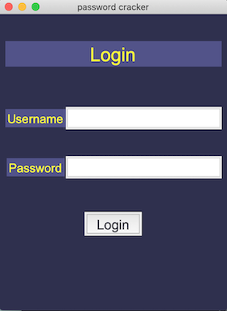

  <h3>
    <a href="https://osaze-ai.github.io/travel-blog/" color="white">
      Live
    

      
# Tkinter pop up window 

## Introduction 

Preperation code for python challenge, password cracker code will be implemented at a latter date with teams code. Current pop up window displays a login form with the tkinter window in responsive mode, includes a login button, labels and grid display.

## Built With :hammer:

- Python 3.11

## What I Learnt :books:

I learnt how to use list grid system in tkinter with a login button and label entries for password login. The Login label above password entry uses pack()followed by grid for password entry. I learnt how to add a python message box in tkinter using IDLE as my compiler to run the code. 

From my coding sprints session on python I learnt how to use lists to display the grid labels with coloumns and rows on the x and y axis. This allowed the pop up window to display the data entry for password login. 

## Code I Am Proud Of :smiley:

Widgits for pop up window

Grid padding using lists

## CHECK IT OUT :film_strip:

<h4> <a href="" color="white"> LIVE </a> 

